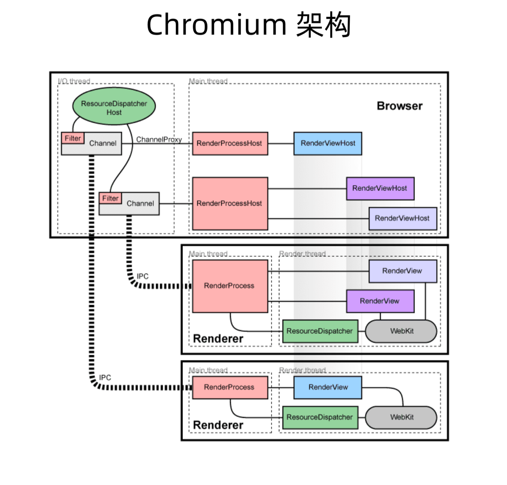
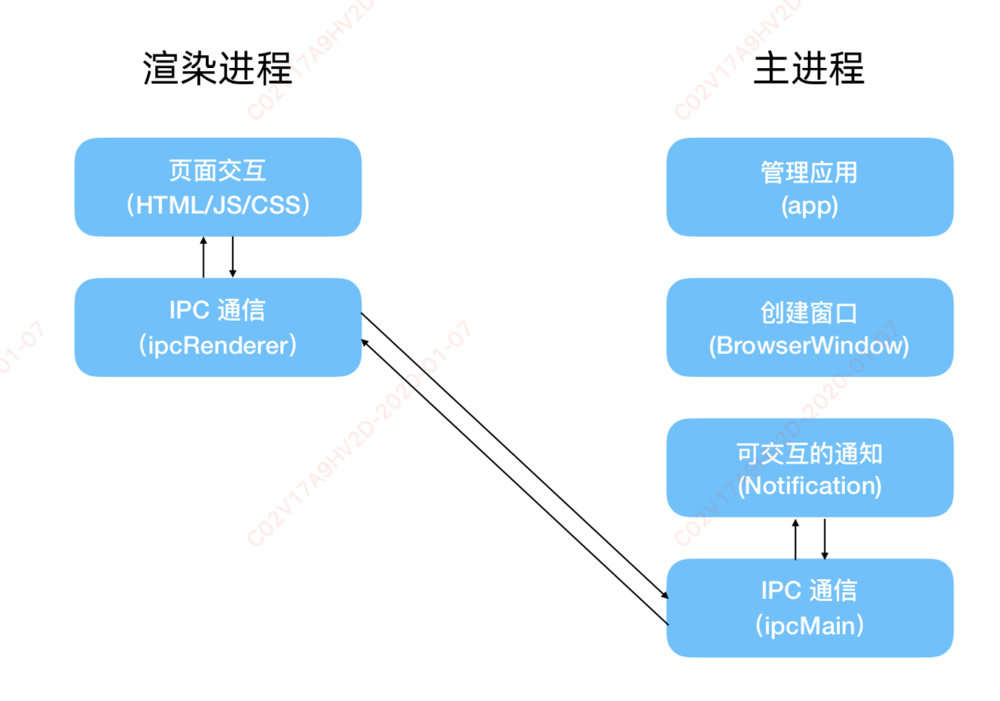
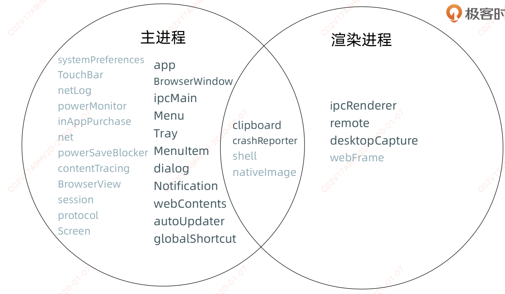

# electron-learn

官网：https://electronjs.org/

## 1. 安装

### nvm 安装

```
Mac/Linux: curl -o- https://raw.githubusercontent.com/nvm-sh/nvm/v0.35.2/install.sh | bash
Windows: https://github.com/coreybutler/nvm-windows/releasesa
验证nvm: nvm --versiona
```

### Node.js/NPM 安装

```
安装 Node.js: nvm install 12.14.0
切换 Node.js 版本:nvm use 12.14.0
验证 npm -v
验证 node -v
```

### node 安装加速机器

```
// mac 在 .bashrc 或者 .zshrc 加入
export NVM_NODEJS_ORG_MIRROR=http://npm.taobao.org/mirrors/node

// Windows 在 %userprofile%\AppData\Roaming\nvm\setting.txt 加入
node_mirror: https://npm.taobao.org/mirrors/node/ npm_mirror: https://npm.taobao.org/mirrors/npm/
```

### Electron 安装

```
npm install electron --save-dev
npm install --arch=ia32 --platform=win32 electron

// 验证安装成功:
npx electron -v (npm > 5.2)
./node_modules/.bin/electron -v
```

### Electron 加速技巧

```
# 设置ELECTRON_MIRROR
ELECTRON_MIRROR=https://cdn.npm.taobao.org/dist/electron/ npm install electron --save- dev
```

## 2. electron 原理

Node.js 和 Chromiums 整合

- Chromium 集成到 Node.js: 用 libuv 实现 messagebump (nw)

- 难点:Node.js 事件循环基于 libuv，但 Chromium 基于 message bump

Node.js 集成到 Chromium




### 2.1. 主进程和渲染器进程

Electron 运行 package.json 的 main 脚本的进程被称为主进程。 在主进程中运行的脚本通过创建 web 页面来展示用户界面。 一个 Electron 应用总是有且只有一个主进程。

由于 Electron 使用了 Chromium 来展示 web 页面，所以 Chromium 的多进程架构也被使用到。 每个 Electron 中的 web 页面运行在它自己的渲染进程中。

在普通的浏览器中，web 页面通常在沙盒环境中运行，并且无法访问操作系统的原生资源。 然而 Electron 的用户在 Node.js 的 API 支持下可以在页面中和操作系统进行一些底层交互。

#### 2.1.1. 主进程和渲染进程之间的区别

主进程使用 BrowserWindow 实例创建页面。 每个 BrowserWindow 实例都在自己的渲染进程里运行页面。 当一个 BrowserWindow 实例被销毁后，相应的渲染进程也会被终止。

主进程管理所有的 web 页面和它们对应的渲染进程。 每个渲染进程都是独立的，它只关心它所运行的 web 页面。

在页面中调用与 GUI 相关的原生 API 是不被允许的，因为在 web 页面里操作原生的 GUI 资源是非常危险的，而且容易造成资源泄露。 如果你想在 web 页面里使用 GUI 操作，其对应的渲染进程必须与主进程进行通讯，请求主进程进行相关的 GUI 操作。

Electron 为主进程（ main process）和渲染器进程（renderer processes）通信提供了多种实现方式，如可以使用 ipcRenderer 和 ipcMain 模块发送消息，使用 remote 模块进行 RPC 方式通信

#### 2.1.2. 使用 Electron 的 API

Electron 在主进程和渲染进程中提供了大量 API 去帮助开发桌面应用程序， 在主进程和渲染进程中，你可以通过 require 的方式将其包含在模块中以此，获取 Electron 的 API

```js
const electron = require('electron');
```

所有 Electron 的 API 都被指派给一种进程类型。 许多 API 只能被用于主进程或渲染进程中，但其中一些 API 可以同时在上述两种进程中使用。 每一个 API 的文档都将声明你可以在哪种进程中使用该 API。

Electron 中的窗口是使用 BrowserWindow 类型创建的一个实例， 它只能在主进程中使用。

```js
// 这样写在主进程会有用，但是在渲染进程中会提示'未定义'
const { BrowserWindow } = require('electron');

const win = new BrowserWindow();
```

因为进程之间的通信是被允许的, 所以渲染进程可以调用主进程来执行任务。 Electron 通过 remote 模块暴露一些通常只能在主进程中获取到的 API。 为了在渲染进程中创建一个 BrowserWindow 的实例，我们通常使用 remote 模块为中间件：

```js
//这样写在渲染进程中时行得通的，但是在主进程中是'未定义'
const { remote } = require('electron');
const { BrowserWindow } = remote;

const win = new BrowserWindow();
```

#### 2.1.3. 使用 Node.js 的 API

Electron 同时对主进程和渲染进程暴露了 Node.js 所有的接口。 这里有两个重要的定义：

1. 所有在 Node.js 可以使用的 API，在 Electron 中同样可以使用。 在 Electron 中调用如下代码是有用的：

```js
const fs = require('fs');

const root = fs.readdirSync('/');

// 这会打印出磁盘根级别的所有文件
// 同时包含'/'和'C:\'。
console.log(root);
```

正如您可能已经猜到的那样，如果您尝试加载远程内容， 这会带来重要的安全隐患。 您可以在我们的 安全文档 中找到更多有关加载远程内容的信息和指南。

2)你可以在你的应用程序中使用 Node.js 的模块。 选择您最喜欢的 npm 模块。 npm 提供了目前世界上最大的开源代码库，那里包含良好的维护、经过测试的代码，提供给服务器应用程序的特色功能也提供给 Electron。

例如，在你的应用程序中要使用官方的 AWS SDK，你需要首先安装它的依赖：

npm install --save aws-sdk
然后在你的 Electron 应用中，通过 require 引入并使用该模块，就像构建 Node.js 应用程序那样：

```js
// 准备好被使用的S3 client模块
const S3 = require('aws-sdk/clients/s3');
```

有一个非常重要的提示: 原生 Node.js 模块 (即指，需要编译源码过后才能被使用的模块) 需要在编译后才能和 Electron 一起使用。

绝大多数的 Node.js 模块都不是原生的， 在 650000 个模块中只有 400 是原生的。

## 3. electron 常用 api

### 3.1. app

主进程

```js
const { app } = require('electron')
app.on('window-all-closed', () => {
  app.quit()
})
```

#### 3.1.1. 事件

https://electronjs.org/docs/api/app#%E4%BA%8B%E4%BB%B6


### 3.2. menu

#### accelerator 快捷键

https://electronjs.org/docs/api/accelerator

1. 快捷键可以包含多个功能键和一个键码的字符串，由符号+结合，用来定义你应用中的键盘快捷键

### 3.3. 渲染进程和主进程



#### Electron 渲染进程

```js
// 引入模块，各进程直接在electron模块引入即可。例子:
const { app, BrowserWindow } = require(‘electron’) // 主进程引入app, BrowserWindow模块

const { ipcRenderer } = require(‘electron’) // 渲染进程引入ipcRenderer
ipcRenderer.invoke(channel, ...args).then(result => { handleResult }) // 渲染进程跟主进程发送请求
```

- 展示 Web 页面的进程称为渲染进程

- 通过 Node.js、Electron 提供的 API 可以跟系统底层打交道

- 一个 Electron 应用可以有多个渲染进程

#### Electron 主进程

ipcMain.handle(channel, handler)，处理理渲染进程的 channel 请求，在 handler 中 return 返回结果

- Electron 运行 package.json 的 main 脚本的进程被称为主进程

- 每个应用只有一个主进程

- 管理原生 GUI，典型的窗口(BrowserWindow、Tray、Dock、Menu)

- 创建渲染进程

- 控制应用生命周期(app)



#### 进程间通信

1. IPC 模块通信

- Electron 提供了 IPC 通信模块，主进程的 ipcMain 和 渲染进程的 ipcRenderer
- ipcMain、ipcRenderer 都是 EventEmitter 对象

2. 进程间通信:从渲染进程到主进程

- Callback 写法:
ipcRenderer.send
ipcMain.on

- Promise 写法 (Electron 7.0 之后，处理请求 + 响应模式)
ipcRenderer.invoke 
ipcMain.handle

3. 进程间通信:从主进程到渲染进程

- 主进程通知渲染进程:
ipcRenderer.on
webContents.send

4. 页面间(渲染进程与渲染进程间)通信

- 通知事件

通过主进程转发(Electron 5之前)
ipcRenderer.sendTo (Electron 5之后) 数据共享

- 数据共享

Web 技术(localStorage、sessionStorage、indexedDB)
使用 remote

#### **注意**

- 少用 remote 模块
- 不要用 sync 模式
- 在请求 + 响应的通信模式下，需要自定义超时限制

## 4. Electron 应用原生能力

### 4.1. 使用 Electron API 创建原生 GUI

- BrowserWindow 
- Tray
- app
- Menu
- dialog 
- TouchBar

### 4.2. 使用 Electron API 获得底层能力

- clipboard 
- screen 
- globalShortcut 
- desktopCapture 
- shell 
- powerMonitor

### 4.3. 使用 Node.js 获得底层能力

- Electron 同时在主进程和渲染进程中对 Node.js 暴露了所有的接口

fs 进行文件读写
crypto 进行加解密

- 通过 npm 安装即可引入社区上所有的 Node.js 库

### 4.4. 使用 Node.js 调用原生模块

- node.js add-on 
- node-ffi

### 4.5. 调用 OS 能力

- WinRT 
- Applescript 
- Shell


## 5. 测试和调试

## 6. 打包

### 6.1. 

1. 在 package.json 应用程序中指定的标准字段 — name, description, version and author.

2. 在 package.json 添加 build 配置:

```json
"build": {
  "appId": "your.id",
  "mac": {
    "category": "your.app.category.type"
  }
}
```

See all options. Option files to indicate which files should be packed in the final application, including the entry file, maybe required.

3. 添加 icons.

制作 icns 图标

- brew install makeicns

- makeicns -in input.jpg -output out.icns

4. 在 package.json 添加 scripts 命令:

```json
"scripts": {
  "pack": "electron-builder --dir",
  "dist": "electron-builder"
}
```

#### 命令行参数（CLI）

- Commands(命令):

```text
  electron-builder build                    构建命名                      [default]
  electron-builder install-app-deps         下载app依赖
  electron-builder node-gyp-rebuild         重建自己的本机代码
  electron-builder create-self-signed-cert  为Windows应用程序创建自签名代码签名证书
  electron-builder start                    使用electronic-webpack在开发模式下运行应用程序(须臾要electron-webpack模块支持)

```

- Building(构建参数):

```text
  --mac, -m, -o, --macos   Build for macOS,                              [array]
  --linux, -l              Build for Linux                               [array]
  --win, -w, --windows     Build for Windows                             [array]
  --x64                    Build for x64 (64位安装包)                     [boolean]
  --ia32                   Build for ia32(32位安装包)                     [boolean]
  --armv7l                 Build for armv7l                              [boolean]
  --arm64                  Build for arm64                               [boolean]
  --dir                    Build unpacked dir. Useful to test.           [boolean]
  --prepackaged, --pd      预打包应用程序的路径（以可分发的格式打包）
  --projectDir, --project  项目目录的路径。 默认为当前工作目录。
  --config, -c             配置文件路径。 默认为`electron-builder.yml`（或`js`，或`js5`)

```

- Publishing(发布):

```text
  --publish, -p  发布到GitHub Releases [choices: "onTag", "onTagOrDraft", "always", "never", undefined]

```

- Other(其他):

```text
  --help     Show help                                                 [boolean]
  --version  Show version number                                       [boolean]
```

- Examples(例子):

```text
  electron-builder -mwl                        为macOS，Windows和Linux构建（同时构建）
  electron-builder --linux deb tar.xz          为Linux构建deb和tar.xz
  electron-builder -c.extraMetadata.foo=bar    将package.js属性`foo`设置为`bar`
  electron-builder --config.nsis.unicode=false 为NSIS配置unicode选项

```

- TargetConfiguration(构建目标配置):

```js
target:  String - 目标名称，例如snap.
arch “x64” | “ia32” | “armv7l” | “arm64”> | “x64” | “ia32” | “armv7l” | “arm64”  -arch支持列表

```

#### 常见错误

##### NPM 下载的问题

因为 NPM 在国内比较慢。导致 electron-V.xxxx.zip 下载失败。这些东西如果是第一次打包的话是需要下载对应 electron 版本的支持文件。解决办法有两个

1. 设置镜像：在.npmrc 文件。然后加入下面这句代码

```text
electron_mirror=http://npm.taobao.org/mirrors/electron/
```

2. 直接去淘宝镜像文件库找到对应的文件并下载，放到指定的目录下，electron 的淘宝镜像地址。下载完之后放到指定的文件。

##### NSIS 下载问题

### 热重载

https://codeday.me/bug/20190129/597088.html

### 热更新

## 7. 脚手架 electron-forge

https://juejin.im/post/5c46ab47e51d45522b4f55b1
